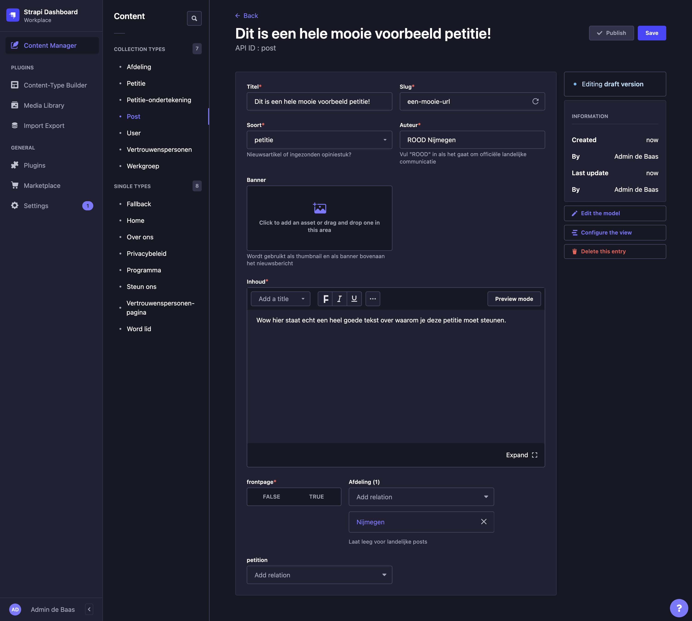
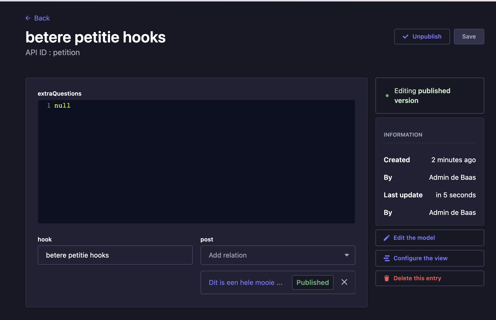
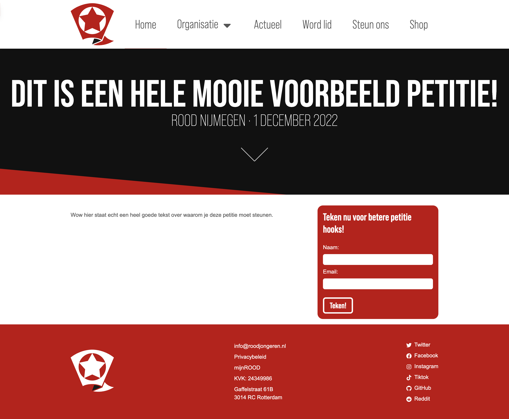
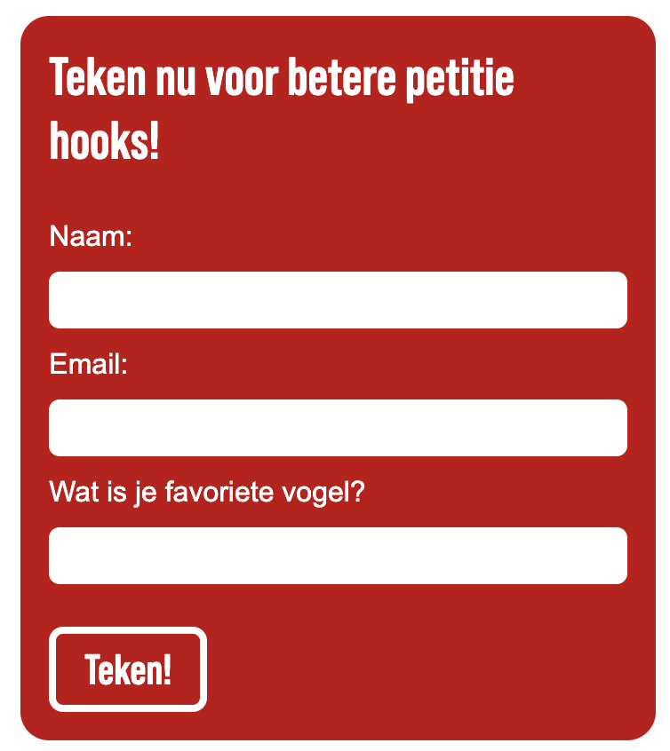
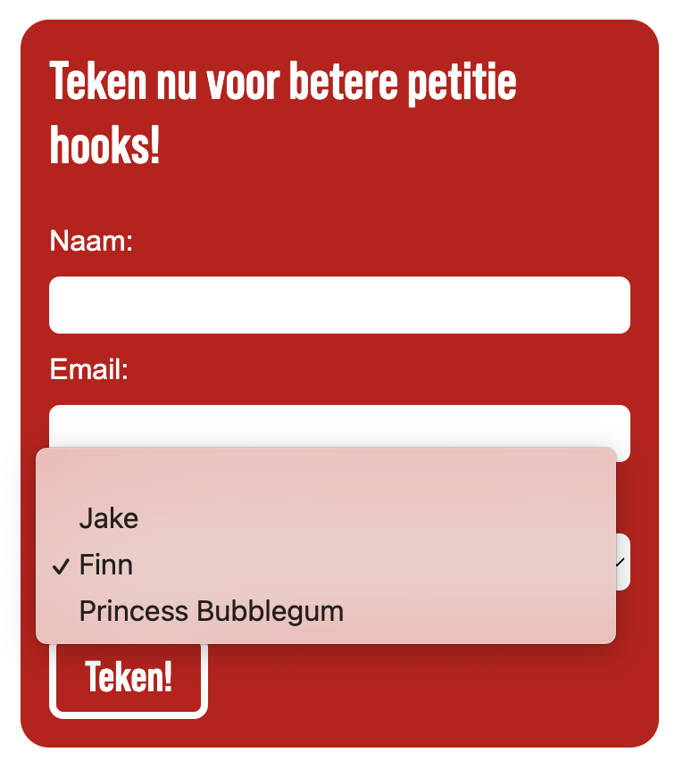
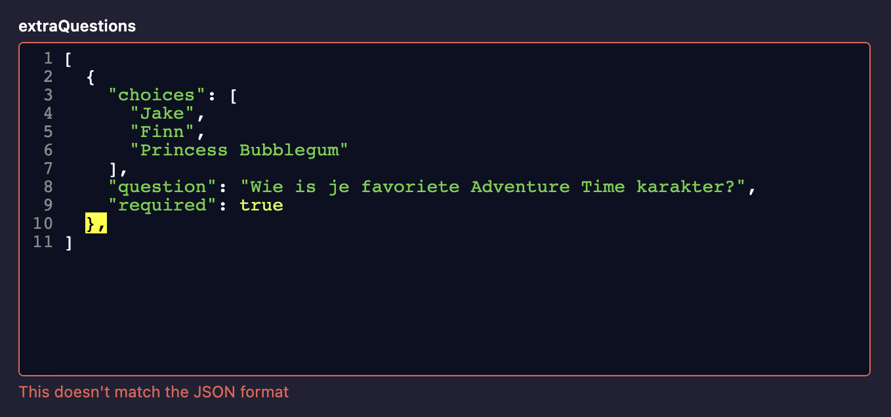

# Hoe maak ik een petitie op de ROOD site?

Omdat een petitie maken op de ROOD site net wat meer werk is dan een gewone post
zal dit document stap voor stap uitleggen hoe je jouw petitie goed kan laten
werken.


## Stap 1: Maak een Post

De eerste stap van een petitie maken is en Post maken. Alle informatie van de
petitiepagina komt namelijk gewoon van een normale Post.

Denk er aan om de "soort" van je post op "Petitie" te zetten. Onderin het scherm kan je een Petitie koppelen, maar die heb je nog niet gemaakt dus kan je voor nu leeg laten. Druk daarna op "Save" maar nog niet op "Publish".




## Stap 2: Maak de Petitie

Nu kan je naar de Petitie admin gaan. Verzin een hook voor je petitie, dit
is wat er komt te staan in de rode petitie box rechts naast je post inhoud.




De Post informatie hoef je nog niet in te vullen, dat gebeurt straks vanzelf.

Je kan het extraQuestions invullen met JSON text die aan de website uitlegt
welke extra questions je wilt vragen.

Gelukkig hoef je niet zo veel van websites of computers te weten hoe je extra
vragen toevoegt aan je petitie. Hier is een makkelijk voorbeeld:

```json
[
  {
    "question": "Wat is je favoriete vogel?",
    "required": true
  }
]
```

Dit komt er zo uit te zien:



Doordat er staat `"required": true` kan je de petitie niet invullen zonder
deze vraag te beantwoorden. Je kan dus `"required": false` gebruiken om
de vraag optioneel te maken. Wat ook werkt is dit veld weglaten.

Dit is een voorbeeld van een meerkeuze vraag:

```json
[
  {
    "question": "Wie is je favoriete Adventure Time karakter?",
    "choices": [
        "Jake",
        "Finn",
        "Princess Bubblegum"
    ]
  }
]
```

Dat komt er zo uit te zien:



Deze vraag is niet verplicht, omdat het `extraQuestions` veld geen `required`
bevat. De open vraag en de meerkeuze vraag zijn de enige twee mogelijkheden,
maar je moet petities ook niet te moeilijk willen maken om in te vullen
natuurlijk. Je kan wel zo veel vragen toevoegen als je wil, en dat zou
allemaal goed moeten gaan. Dit is een voorbeeld met vier vragen:

```json
[
  {
    "question": "Hoe gaat het?",
    "choices": [
      "Goed",
      "Heel goed"
    ]
  },
  {
    "question": "Wie is je favoriete kapitalist?",
    "required": true
  },
  {
    "question": "Wie is je favoriete Bolsjewist?",
    "choices": [
      "Alexandra Kollontai",
      "Anders namelijk:"
    ],
    "required": true
  },
  {
    "question": "Anders namelijk (wanneer boven ingevuld)?",
  }
]
```

De website kan errors geven over de syntax van het `extraQuestions` veld, dan staat er "This doesn't match the JSON format". Dit betekent dat de computer
je informatie niet correct vindt. Helaas kunnen computers (nog) geen
gedachten lezen en moet je alles precies invullen zoals die verwacht.

Als je bijvoorbeeld een komma mist of te veel hebt ingevuld zal de website
klagen, en je fout geel kleuren:



Deze komma mag hier niet staan want JSON verwacht alleen kommas tussen waardes
en niet aan het einde. Je kan bijvoorbeeld ook zien dat aan het eind van de
`"choices"` lijst geen komma staat, maar tussendoor wel.

Het is ook belangrijk om elk stukje tekst te omsluiten met aanhalingstekens.
Dit moeten de rechte aanhalingstekens zijn, als je het nodig hebt kan je er
hier eentje kopieren:

```
"
```

Hopelijk lukt het om met deze voorbeelden je eigen extra questions te maken
voor je petities, anders kan je ook nog contact opnemen met het webteam.


## Stap 3: Koppelen

De makkelijkste stap is om de petitie en de post te combineren. Ga naar de
Post die je net geschreven hebt, en koppel helemaal onderin je Petitie. Je
kan deze herkennen aan de hook die je net geschreven hebt.


## Stap 4: Publiceren

Als je blij bent met alle tekst die je hebt geschreven kan je gaan publiceren.

Je kan eerst de petitie publiceren en daarna de post, dan weet je zeker dat
de pagina er goed uit zal zien inclusief petitie box. De website admin
zal vragen of je alles weet als je de petitie probeert te publiceren omdat de
post nog niet gepubliceerd is. Deze waarschuwing kan je weg klikken, dit is
een typisch kip/ei probleem.

Nadat je je Petitie hebt gepubliceerd kan je je Post publiceren en dan staat
het op de website! Ga naar het Actueel tabje om de petitie te zien.


## Stap 5: Korte URL maken (optioneel)

We bezitten vanuit ROOD (via Jelle) het domein jong.red. Het doel van deze
site is om korte en schrijfbare urls te maken à la bit.ly en tinyurl. Een
voorbeeld van zo'n korte url is https://jong.red/aanmelden

Het is vaak handig om mensen snel naar je petitie te kunnen wijzen. Ook is
het bij een QR code belangrijk om je URL kort te houden zodat de QR code klein
is.

Als je dus een korte URL wil maken voor je petitie heb je toegang nodig tot
het systeem van jong.red, vraag hiervoor toegang aan het webteam.


## Stap 6: Je handtekeningen verzamelen!

Hopelijk heb je een succesvolle petitie gevoerd en veel handtekeningen
verzameld. Nu moet je waarschijnlijk ergens de lijst van handtekeningen
overhandigen. Deze lijst is helaas nog niet makkelijk uit de website te
krijgen. (Ook staan er veel emailadressen in en deze worden door de GDPR/AVG
gezien als persoonsgegevens).

Totdat we een mooi export systeem hebben gebouwd om deze lijst te krijgen
zal je bij het webteam moeten zijn. Zij kunnen een mooie export voor je maken
met een grote lijst van alle bevestigde handtekeningen.

Succes!
